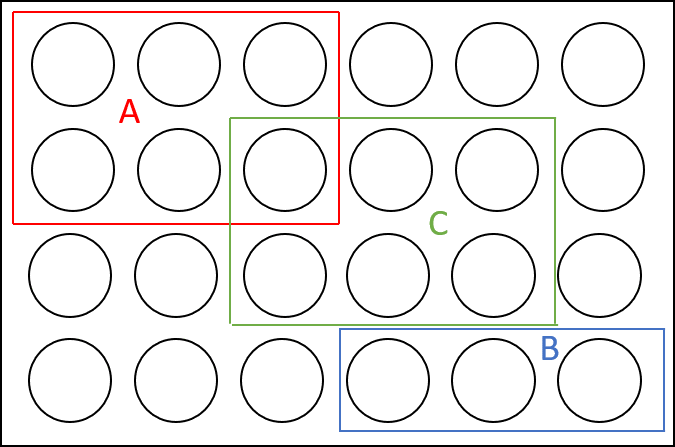

Welcome! In this note, we will review important concepts in the slides *Probability and Statistics*, as well as how to calculate various values using R. 

## 1. Concepts Related to Experiments

- **Experiment**: activity for which the final state of affairs cannot be specified in advance, but for which a set containing all potential state of affairs is known
    - Outcome of the experiment: final result, observation or measurement from the experiment
- **Sample Space** ($\Omega$): A set containing all possible outcomes of a given experiment.
- **Event**: An event is any collection of possible outcomes of an experiment. This is, an event is any subset of $\Omega$, including $\Omega$ itself.

## 2. Probability

- **Classical definition of probability**
    - Let $\Omega$ be the finite sample space of an experiment having $N(\Omega)$ *equally likely* outcomes, and let $A \subset \Omega$ be an event containing $N(A)$ elements. Then the probability of the event $A$, $P(A)$, is given by:

\begin{equation}
  P(A) = \frac{N(A)}{N(\Omega)}
\end{equation}

    - For example, in the picture below. Suppose that the outer box denotes the sample space, and each circle represents an outcome, which are all equally likely. The the probability of event A, which contains six outcomes, is: $P(A) = \frac{N(A)}{N(\Omega)} = \frac{6}{24} = \frac{1}{4}$
    
```{r, echo=FALSE, out.width = "30%", fig.align = "center"}

```


- **Disjoint events**: The events $A$ and $B$ are disjoint if $A \cap B = \emptyset$
    - Events A and B, as in the picture above, are disjoint events.
    
- **Probability Axioms**
    1. Probability of any event is non-negative
    $$P(A) \geq 0$$
    2. Probability that one of the outcomes in the sample space occurs is 1
    $$P(\Omega) = 1$$
    3. \textcolor{red}{Addition Rule}: If events $A$ and $B$ are *mutually exclusive*, then
    $$P(A\ \text{or}\ B) = P(A) + P(B)$$
        - As in the picture above, events A and B are mutually exclusive, so: $P(A \text{ or } B) = P(A) + P(B) = \frac{6}{24} + \frac{3}{24} = \frac{3}{8}$
    
- **Useful Rules of Probability**
    1. $P(A) = 1 - P(\text{not } A)$
    2. \textcolor{red}{Law of Total Probability}: $P(A) = P(A \text{ and } B) + P(A \text{ and not } B)$
    3. General addition rule: $P(A \text{ or } B) = P(A) + P(B) - P(A \text{ and } B)$
    
- **Conditional probability**: If $P(B) \neq 0$, then the conditional probability of event $A$, given event $B$, is:
  \begin{equation}
    P(A \mid B) = \frac{P(A \cap B)}{P(B)}
  \end{equation}
    - Independent events: The events $A$ and $B$ are independent if and only if: $P(A \cap B) = P(A) P(B) \Rightarrow P(A \mid B) = P(A)$
    - Law of total probability: $P(A) = P(A \mid B) P(B) + P(A \mid B^c)P(B^c)$
    - Bayes' Rule: 
    \begin{equation}
      P(A \mid B) = \frac{P(B \mid A) P(A)}{P(B)}
    \end{equation}

## 3. Random Variables and Probability Distribution

- What is a variable?
    - Unit of analysis: the particular cases we study.
    - Variable: characteristic in which we are interested. It pertains to cases.
    - Values: The possible outcomes that a single variable can take.
    
- \textcolor{red}{Random variable}: A numerical summary of a random outcome

- **Probability distribution**: Probability of an event that a random variable takes a certain value
    - Probability density function (PDF): $f(x)$
    - Probability mass function (PMF): $f(x) = P(X = x)$ *only for discrete random variables*
    - Cumulative distribution function (CDF): $F(x) = P(X \leq x)$
    
- **Bernoulli Distribution**
    - Bernoulli$(p)$
    - Parameter: $p$
    - Only takes two values: $\{0, 1\}$
    $$X = 
    \begin{cases}
      1 \qquad & \text{if success}\\
      0 \qquad & \text{if failure}
    \end{cases}$$
    - PMF: 
    $$f(x) = P(X = x) = 
    \begin{cases}
      p \qquad & \text{if } x = 1\\
      1-p \qquad & \text{if } x = 0\\
      0 \qquad & \text{else}
    \end{cases}$$

- **Binomial Distribution**
    - Binomial$(n, p)$
    - Parameters: $n$, $p$
    - *Generalization* of the Bernoulli distribution ($n$ independent Bernoulli trials)
    - Takes any values of $0, 1, 2, \dots, n$
    - PMF:
    $$P(X = x) = {{n}\choose{x}} p^x (1-p)^{n-x},\ n = 0, 1, 2, \dots, n$$
    - CDF: 
    $$F(x) = P(X \leq x) = \sum_{k=0}^{x} {{n} \choose {x}} p^x (1-p)^{n-x} = \sum_{k=0}^{x} \Pr(X = k)\ x = 0,1,2,\dots,n$$
- **Uniform Distribution**
    - Uniform$(a,b)$
    - Parameters: $a$, $b$
    - PDF:
      $$f(x) = 
      \begin{cases}
      \frac{1}{b-a} \qquad & \text{if } a \leq x \leq b\\
      0 \qquad &\text{else}
      \end{cases}$$
    - CDF: 
    $$F(x) = \Pr(X \leq x) = 
    \begin{cases}
      0 \qquad & \text{if } x < a\\
      \frac{x-a}{b-a} \qquad & \text{if } a \leq x < b\\
      1 \qquad &\text{if } x \geq b
    \end{cases}$$
- **Normal Distribution**
    - $\mathcal{N}(\mu, \sigma^2)$
    - Parameters: $\mu$, $\sigma$
    - *Standard Normal*: $\mathcal{N}(0, 1)$
        - If $X \sim \mathcal{N}(\mu, \sigma^2)$, we have $\frac{X - \mu}{\sigma} \sim \mathcal{N}(0,1)$

### 3.1 Simulate Random Variables in R

We can easily simulate a random variables in R, as well as calculating different probabilities of a pre-defined distribution. 

1. **Random draws from a certain distribution**: You can use `rbinom` to make random draws from a Bernoulli or Binomial distribution. For example, we can make one random draw from Bernoulli(p=0.5) by:

```{r}
set.seed(08540) #set seed to make sure codes are reproducible
#Draw 1 value from Bernoulli(0.5)
rbinom(n = 1,
       size = 1,
       prob = 0.5)
```

We can also make multiple draws at once: say we want 5 draws from Bernoulli(p=0.3):

```{r}
set.seed(08540)
#Draw 5 values from Bernoulli(0.3)
rbinom(n = 5,
       size = 1,
       prob = 0.3)
```

And we can make random draws from Binomial distribution by changing the `size` of `rbinom`, say we want to draw from Binomial(n=5, p=0.2):

```{r}
set.seed(08540)
#Draw 1 value from Binomial(5, 0.2)
rbinom(n = 1,
       size = 5,
       prob = 0.2)
```

Similarly, we can use `runif()` to draw from Uniform distribution, and `rnorm()` from Normal distribution.

2. **Calculate probabilities from a certain distribution**: We can also calculate the PMF (PDF) or CDF from a certain distribution. For example, say we want to calculate $P(X=3)$, where $X \sim \text{Binomial}(5, 0.4)$. Using the formula of Binomial PMF, we now that:

$$P(X=3) = {5 \choose 3} \times 0.4^3 \times (1-0.4)^{(5-3)} = 0.2304$$
We can also calculate this with `dbinom()` like below:

```{r}
dbinom(x = 3,
       size = 5,
       prob = 0.4)
```

Similarly, we can use `dunif()` and `dnorm()` to calculate the PDF of Uniform and Normal distribution.

In addition, CDF can be calculated with `pbinom()`, `punif()` and `pnorm()`.

```{r}
#Calculate P(X <= 3) 
pbinom(q = 3,
       size = 5,
       prob = 0.4)
```


## 4. Expectation and Variance

- Population vs. Sample
    - \textcolor{red}{Population}: all the cases or units of analysis in which we are interested
    - \textcolor{red}{Sample}: a subset that we draw from the population in order to learn about the population
    - \textcolor{red}{Inference}: the process by which we use data from the sample to learn or infer the characteristics of the population
    
- Population-level features
    - **Expectation**: 
        - Discrete R.V.: $E[X] = \sum_{x} x \Pr(X = x)$
        - Continuous R.V.: $E[X] = \int_{a}^{b} x \cdot f(x) dx$
    - **Variance**: $\sigma_X^2 = \text{Var}(X) = E[(X - \mu_X)^2] = E[X^2] - \{E[X]\}^2$

- Sample-level features
    - **Sample mean**: $\bar{X} = \frac{1}{N} \sum_{i=1}^{N} X_i$
    - **Sample variance**: $s^2 = \frac{1}{N} \sum_{i=1}^{N} (X_i - \bar{X})^2$
    
- \textcolor{red}{Law of Large Numbers}: As the number of trials $n$ gets largers, the sample mean $\bar{X}$ will be close to the population mean (expectation) $E[X]$.

- **Z-score**: $\text{z-score of } x_i = \frac{x_i - \bar{x}}{S_x}$

- \textcolor{red}{Central Limit Theorem (CLT)}: Suppose we have a random sample of $n$ i.i.d. units : $(X_i)_{i=1}^{n}$ from a population with expectation $E[X]$ and variance $V(X)$:
  $$\frac{\bar{X}_n - E[X]}{\sqrt{V(X)/n}} \to_d \mathcal{N}(0,1)$$
  
    - Note that $\frac{\bar{X}_n - E[X]}{\sqrt{V(X)/n}}$ is the *Z-score of the sample mean*
    - So CLT says the Z-score of the sample mean *converge in distribution* to the standard Normal.
    - Note that $V(X)$ is the variance of the sample, and $\sqrt{V(X)/n}$ is the standard error of the sample mean.
    
- \textcolor{red}{Standard Error}: estimated standard deviation of the sampling distribution
    - If our estimator is the sample mean $\bar{X} = \frac{1}{N} \sum_{i=1}^{N} X_i$, the standard error $\sqrt{Var(\bar{X})} = \frac{\sqrt{Var(X)}}{N}$
    - Proof (just for reference)
    \begin{align*}
      Var(\bar{X}) %= Var(\frac{1}{N} \sum_{i=1}^{N} X_i)\\
      &= \frac{1}{N^2} Var(\sum_{i=1}^{N} X_i)\\
      &= \frac{1}{N^2} \sum_{i=1}^{N} Var(X_i)\\
      &= \frac{1}{N^2} \times N \times Var(X_i)\\
      &= \frac{Var(X_i)}{N}
    \end{align*}
- \textcolor{red}{Confidence Interval}: a range of values that are likely to include the true value of the parameter
    - *95% confidence interval*: Over repeated sampling, the 95% confidence interval would contain the true value of the parameter 95% of the time.
    - See a visualization at: https://rpsychologist.com/d3/ci/
    
**Example: 95% CI of the sample mean estimator**

- By CLT, we know that:
$$\frac{\bar{X}_n - E[X]}{\sqrt{V(X)/n}} \to_d \mathcal{N}(0,1)$$
- where 
    - $\bar{X}_n$ is the sample mean of our sample $\{X_1, \dots, X_n\}$
    - $E[X] = \mu$ is the population mean (expectation), *the value we want to estimate*
    - $V(X) = \sigma^2$ is the population variance, *which we don't know*
- we use the sample variance $s^2 = \frac{1}{n-1} \sum_{i=1}^{n} (X_i - \bar{X}_n)^2$ to approximate $\sigma^2$ 
- With standard Normal, we know that:
  $$\Pr(-1.96 \leq \frac{\bar{X}_n - E[X]}{\sqrt{V(X)/n}} \leq 1.96) = 0.95$$
    - Why? Denote $Z \equiv \frac{\bar{X}_n - E[X]}{\sqrt{V(X)/n}}$
    - By the CDF of standard Normal: $\Pr(Z \leq 1.96) \approx 0.975$, $\Pr(Z \leq -1.96) \approx 0.025$
    - So $\Pr(-1.96 \leq Z \leq 1.96) \approx 0.975 - 0.025 = 0.95$
    
```{r}
#Prob(Z <= 1.96) 
pnorm(1.96)

#Prob(Z <= -1.96)
pnorm(-1.96)

#Prob(-1.96 <= Z <= 1.96)
pnorm(1.96) - pnorm(-1.96)
```


```{r, echo=FALSE}
# plot the standard normal density on the interval [-4,4]
curve(dnorm(x),
      xlim = c(-4, 4),
      main = bquote("95% Confidence Interval"),
      yaxs = 'i',
      xlab = 'Z-score',
      ylab = '',
      lwd = 2,
      axes = 'F')

# add x-axis
axis(1, 
     at = c(-4, -1.96 , 0, 1.96, 4), 
     padj = 0.75,
     labels = TRUE)

#alpha = 0.05
polygon(x = c(-1.96, seq(-1.96, 1.96, 0.01), 1.96),
        y = c(0, dnorm(seq(-1.96, 1.96, 0.01)),0), 
        col = 'steelblue')

text(0, 0.1, labels = "Covers 95% of the area")

```

- Re-arrange terms, we have:

\begin{align*}
  &\Pr(-1.96 \leq \frac{\bar{X}_n - E[X]}{\sqrt{V(X)/n}} \leq 1.96) = 0.95\\
  &\Pr(-1.96 \times \sqrt{V(X)/n} \leq \bar{X}_n - E[X] \leq 1.96 \times \sqrt{V(X)/n}) = 0.95\\
  &\Pr(-1.96 \times \sqrt{V(X)/n} - \bar{X}_n \leq - E[X] \leq 1.96 \times \sqrt{V(X)/n} - \bar{X}_n) = 0.95\\
  &\Pr(1.96 \times \sqrt{V(X)/n} + \bar{X}_n \geq E[X] \geq -1.96 \times \sqrt{V(X)/n} + \bar{X}_n) = 0.95\\
  &\Pr(\bar{X}_n + 1.96 \times \sqrt{V(X)/n} \geq E[X] \geq \bar{X}_n -1.96 \times \sqrt{V(X)/n}) = 0.95
\end{align*}

- So the 95% CI is:
$$[\bar{X}_n -1.96 \times \sqrt{V(X)/n}, \bar{X}_n + 1.96 \times \sqrt{V(X)/n}]$$

- Again, we don't know $V(X)$, and we use $s^2$ to estimate $V(X)$, so the esimated 95% CI is:
$$[\bar{X}_n -1.96 \times \sqrt{s^2/n}, \bar{X}_n + 1.96 \times \sqrt{s^2/n}]$$

- Note that in R, you can use `var()` to calculate $s^2$

- Now let's calculate the 95% in R:


```{r, echo=FALSE}
set.seed(08540)
x = rnorm(20)
```

```{r}
#Assume we have a sample of 20 numbers stored in object `x`
x

# 1) Calculate the sample mean
x.mean = mean(x)
mean(x)

# 2) Calculate s^2
x.var = var(x)
x.var

# 3) Calculate the s.e.
x.se = sqrt(x.var/length(x))
x.se

# 4) Calculate the 95% CI
x.ci = c(x.mean - x.se * 1.96, x.mean + x.se * 1.96)
x.ci
```

**Example: Two Independent Samples**

- Say we want to estimate the difference in means of two independent samples $E[X] - E[Y]$
- The difference in sample means is simply: $\bar{X}_{n_x} - \bar{Y}_{n_y}$
- The standard error is: $\sqrt{\frac{s_x^2}{n_x} + \frac{s_y^2}{n_y}}$, where
    - $s_x^2$ and $s_y^2$ are the sample variance of $X$ and $Y$
    - $n_x$ and $n_y$ are the respective sample sizes
- So the 95% CI can be estimated by:
$$\bigg[\bar{X}_{n_x} - \bar{Y}_{n_y} - 1.96 * \sqrt{\frac{s_x^2}{n_x} + \frac{s_y^2}{n_y}}, \bar{X}_{n_x} - \bar{Y}_{n_y} + 1.96 * \sqrt{\frac{s_x^2}{n_x} + \frac{s_y^2}{n_y}}\bigg]$$

**Example: Two Dependent Samples**

- In the previous example, if $X$ and $Y$ are not independent, we need to calculate the standard error by incorporating the *covariance* of $X$ and $Y$. 
- Suppose $X$ and $Y$ are paired (for example $X$ measures the outcome for each observation at $T=0$ and $Y$ measures the outcome for the same group of observations at $T=1$), the variance of $X-Y$ is given by:
$$Var(X-Y) = Var(X) + Var(Y) - 2Cov(X,Y)$$
    - where $Cov(X,Y)$ represents the covariance between $X$ and $Y$, which can be calculated in R using `cov()`. 
- And the standard error is:
$$\sqrt{\frac{s_x^2}{n} + \frac{s_y^2}{n} - \frac{2 Cov(X,Y)}{n}}$$
    - where $n$ represents the sample size (which we assume to be the same for $X$ and $Y$.)