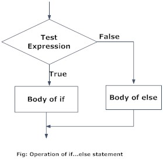

Welcome! This document contains materials that would be helpful for week 8 of POL 345. Specifically, we will cover two important control structures in programming: *for loop* and *if statement*, as well as the *K-Means* algorithm. 

In this document, we will focus on the *if statement*.

### 2. If statement^[Some materials from https://www.datamentor.io/r-programming/if-else-statement/]

#### 2.1 Basic Idea of if statement

A lot of times, we want to apply different operations to different objects, depending on the value of the object. For example, when we calculate the absolute value of a number, we keep the original value for non-negative values, but not for negative numbers. In such cases, we can use the *if statement* to automatically decide which operation to execute, depending on the *test* pre-defined by the programmer. 

The basic syntax of *if statement* is as the following:
```{r, eval = FALSE}
if (test_expression){
  statement
}
```

In the chunk above:

  - `test_expression` is a the *test* that you want to conduct, which should return a value of either `TRUE` or `FALSE`. 
  - `statement` is the block of code to be executed, **only when `test_expression` returns `TRUE`**.

Below is an example of a basic if statement:

```{r}
#Determine if a number is positive
x = 5
if (x > 0){
  print("Positive number")
}
```

As you can see, in the example above, `test_expression` compares the value in object `x` with 0, and returns `TRUE` if `x` is positive, and `FALSE` otherwise. Since `x` equals 5, which is positive, the `test_expression` returns `TRUE`, and the code `print("Positive number")` get executed. 

Alternatively, if `x` is non-positive, the code `print("Positive number")` will simply be ignored since the `text_expression` returns `FALSE`, as in the example below:

```{r}
x = -5 #x is now negative
if (x > 0){
  print("Positive number")
}
```

The basic structure of the if statement can be illustrated in the following figure:

```{r, echo = FALSE, out.width = "30%", fig.align = "center"}
knitr::include_graphics("images/r-if-statement.jpg")
```

#### 2.2 if-else statement

In the example above, the block of code in `statement` will only be executed when `test_expression` returns `TRUE`. What if we want to execute another block of code when `text_expression` returns `FALSE`? This is when we want to use a similar structure called *if-else statement*. The basic syntax is as the following:

```{r, eval = FALSE}
if (test_expression) {
  statement1
} else {
  statement2
}
```

In the chunk above: 

  - `test_expression` is a the *test* that you want to conduct, which should return a value of either `TRUE` or `FALSE`. 
  - `statement1` is the block of code to be executed, **only when `test_expression` returns `TRUE`**.
  - `statement2` is the block of code to be executed, **only when `test_expression` returns `FALSE`**.

Below is an example of a basic if-else statement:

```{r}
#Calculate the absolute value of a number

x = -3

if (x >=0){
  cat("The absolute value of x is", x)
} else {
  cat("The absolute value of x is", -x)
}
```

As you can see, in the example above, either `x` or `-x` will be printed, depending on whether `x` is a non-negative number. 

The basic structure of the if-else statement can be illustrated in the following figure:

```{r, echo = FALSE, out.width = "30%", fig.align = "center"}

```

#### 2.3* if-else-if statement

What if we want to execute more than two different blocks of code, depending on the value of the object? For example, we might want to decide whether a certain number is positive, negative, or equals zero. In such cases, we can add use the *if-else-if* statement, like in the example below:

```{r}
x = 0

if (x > 0){
  cat("x is positive")
} else if (x < 0){
  cat("x is negative")
} else {
  cat("x is zero")
}

```

#### 2.4 Combine if-statement with for loop

It might seem a little stupid if we write an if-statement for a single value, like in the examples above. However, the if-statement can be very useful if we have many elements, and we don't want to manually determine which operation to execute for each of them. In such cases, we can combine the if-statement with a for loop, like in the example below:

```{r}
#Calculate the absolute value for a vector of numbers
x = c(2, 0, -1, 5, -3, -6)
x.abs = c() #the container to store absolute values of each element in x
for (i in 1:length(x)){
  if (x[i] >=0) {
    x.abs[i] = x[i]
  } else {
    x.abs[i] = -x[i]
  }
}

print(x.abs)
```

In the example above, we first loop over each element in the vector `x`. Then, depending on the value of each element, we calculate the absolute value of that element, and store all the results in vector `x.abs`.